# 🎬 BookMoviShow

🚀 Built with MERN Stack | Secure Payments | Real-Time Seat Locking  

BookMoviShow is a full-stack Movie Ticket Booking Web Application that allows users to browse movies, select seats, make secure payments, and manage bookings seamlessly. The system includes a real-time seat locking mechanism to prevent double booking and ensure smooth transaction handling.

---

## 📌 Project Overview

BookMoviShow provides a complete movie booking experience including:

- Browse Now Showing & Coming Soon movies  
- View detailed movie information  
- Select theatres based on location  
- Choose seats interactively  
- Secure online payment integration  
- Booking history management  
- Favorite movies feature  

This project demonstrates full-stack development using the MERN stack with authentication, third-party API integration, and secure payment processing.

---

## 🚀 Features

- 🔐 User Authentication (Register / Login)  
- 🎥 Browse Movies (Now Showing & Coming Soon)  
- 🌍 Location-Based Theatre Fetching (Geoapify API)  
- 🪑 Interactive Seat Selection System  
- 🔒 Real-Time Seat Locking (Prevents double booking)  
- 💳 Razorpay Payment Integration  
- 📜 Booking History  
- ❤️ Favorite Movies  
- 📱 Fully Responsive UI  

---

## 📸 Screenshots

### 🏠 Home Page
<p align="center">
  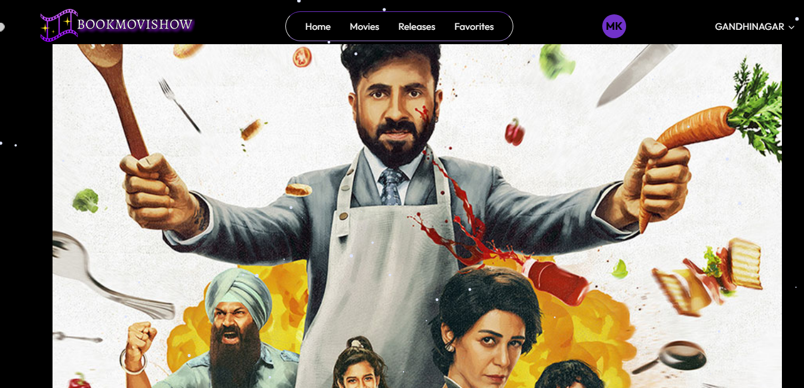
  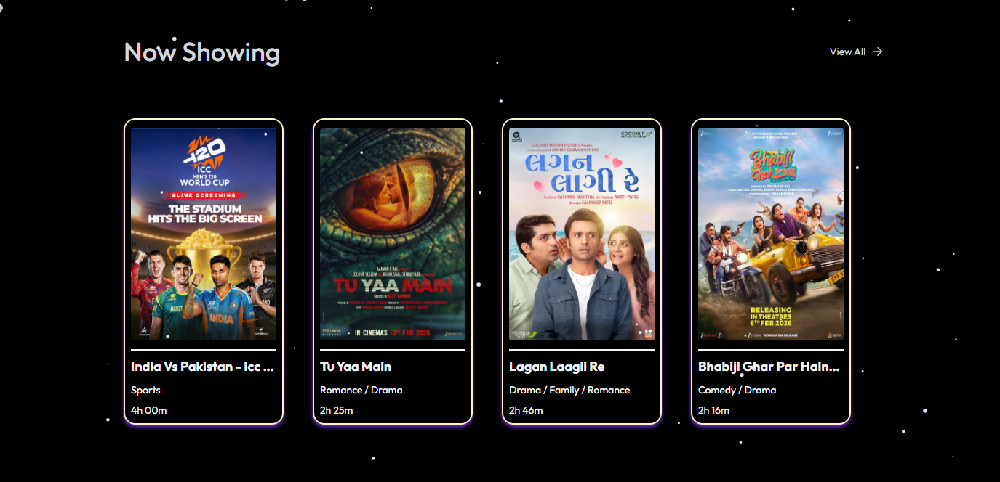
</p>
<p align="center">
  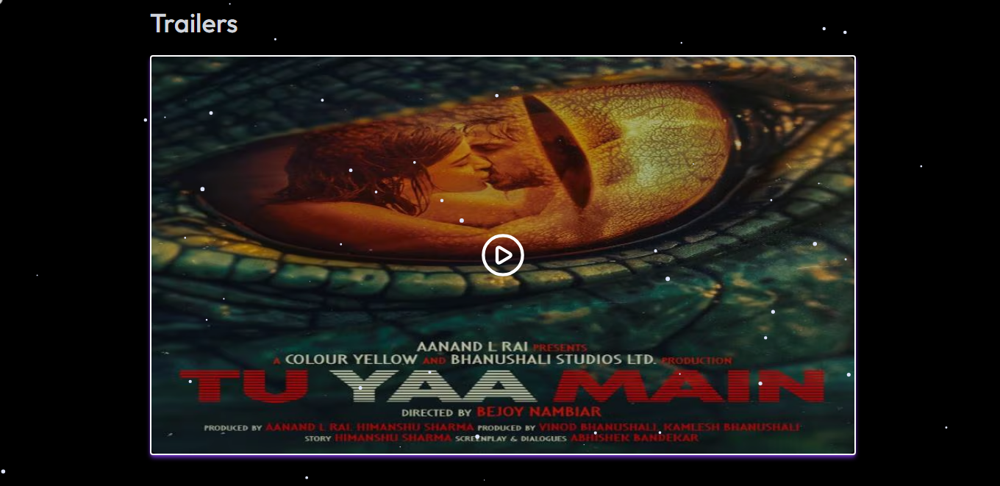
  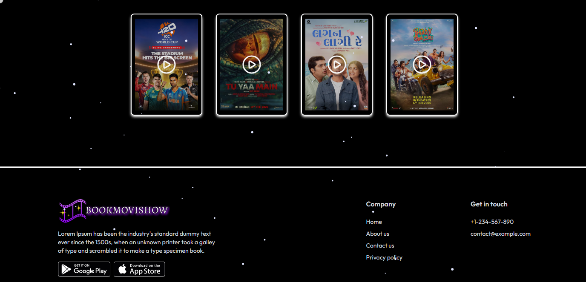
</p>

---

### 🎬 Movies Page
<p align="center">
  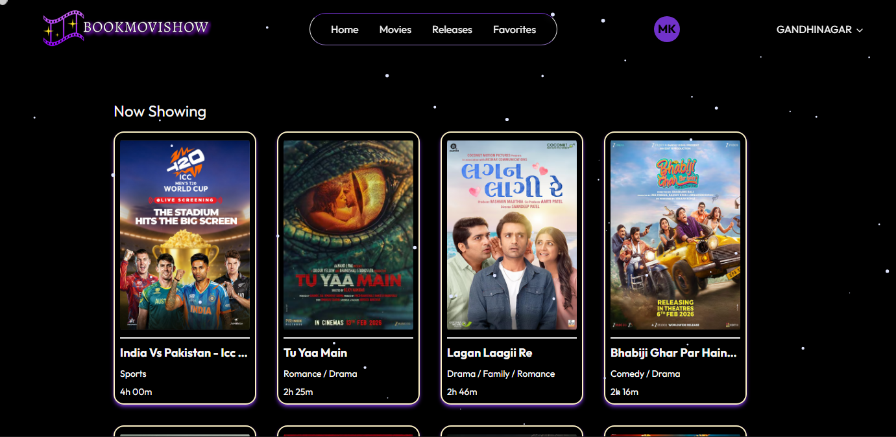
  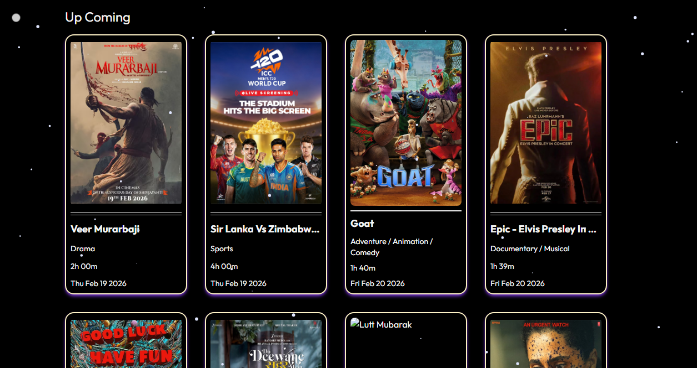
</p>

---

### 🎥 Movie Details Page
<p align="center">
  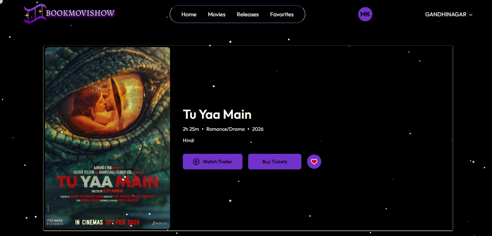
  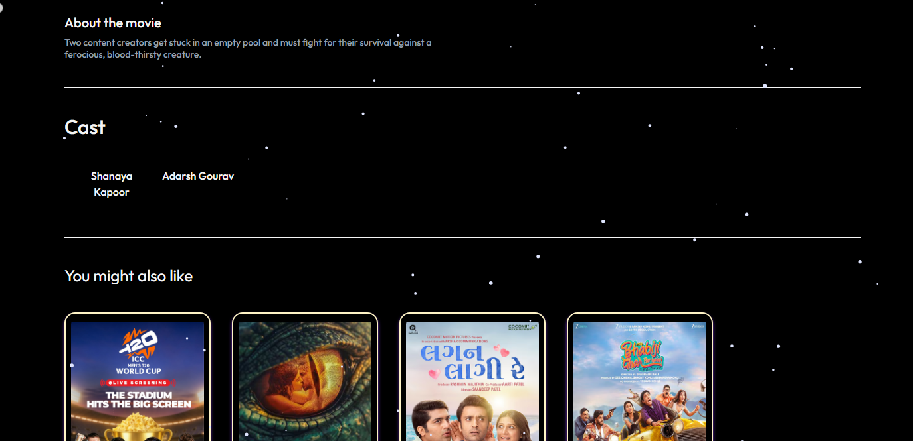
</p>
<p align="center">
  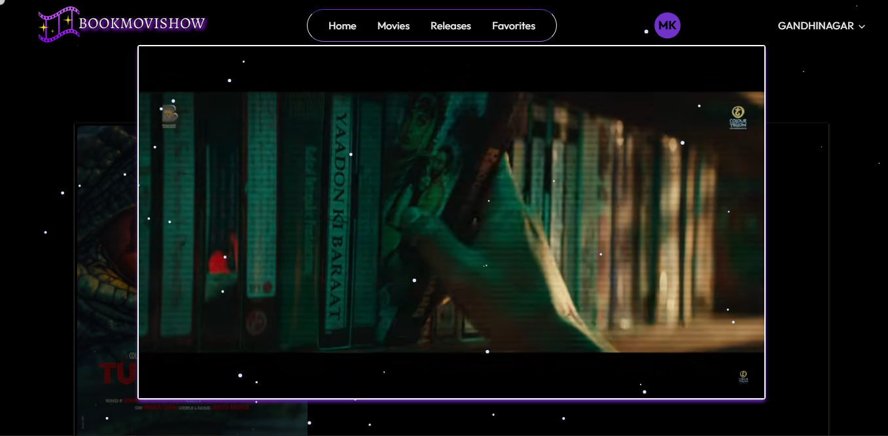
</p>

---

### 🏢 Theater List
<p align="center">
  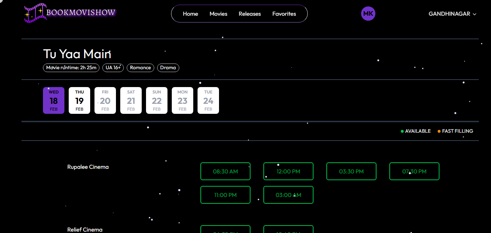
  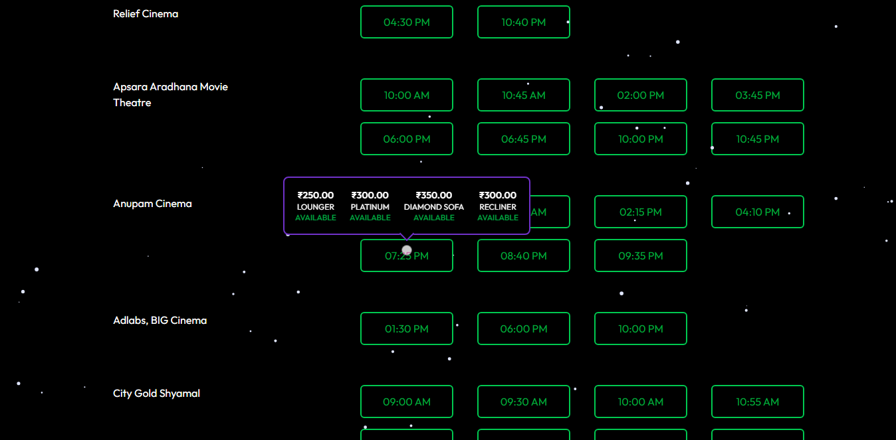
</p>

---

### 🪑 Seat Selection Page
<p align="center">
  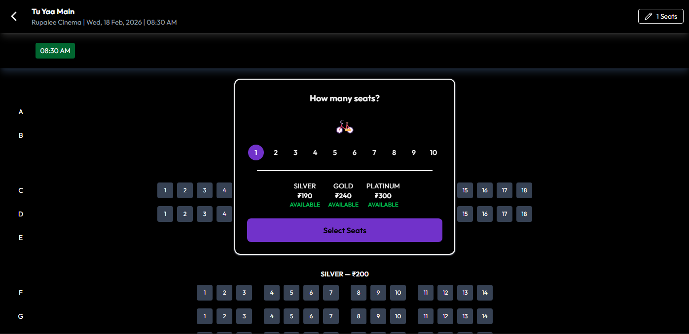
  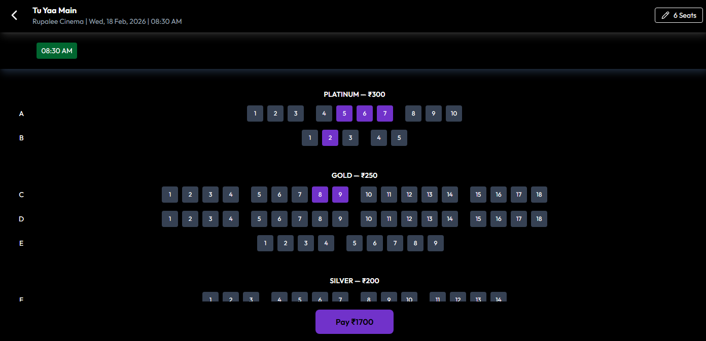
</p>
<p align="center">
  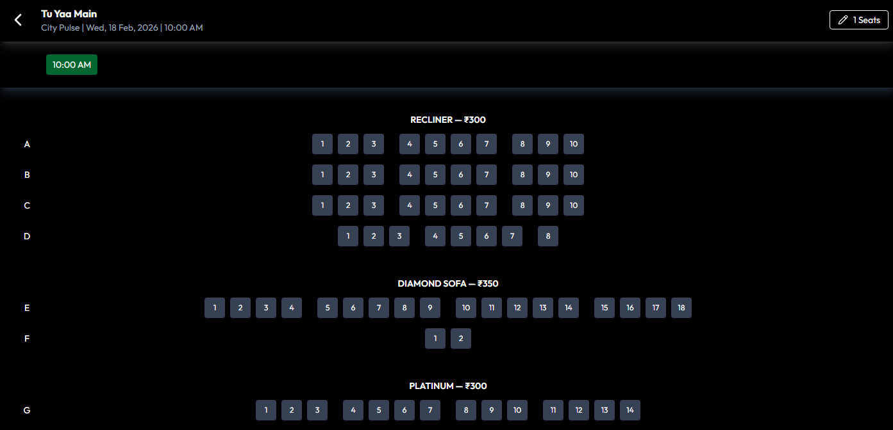
  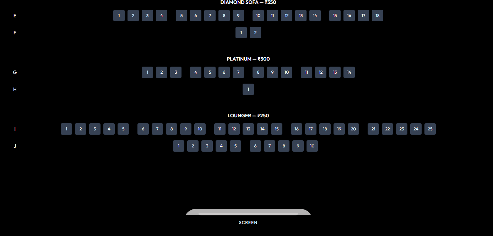
</p>

---

### 💳 Payment Page
<p align="center">
  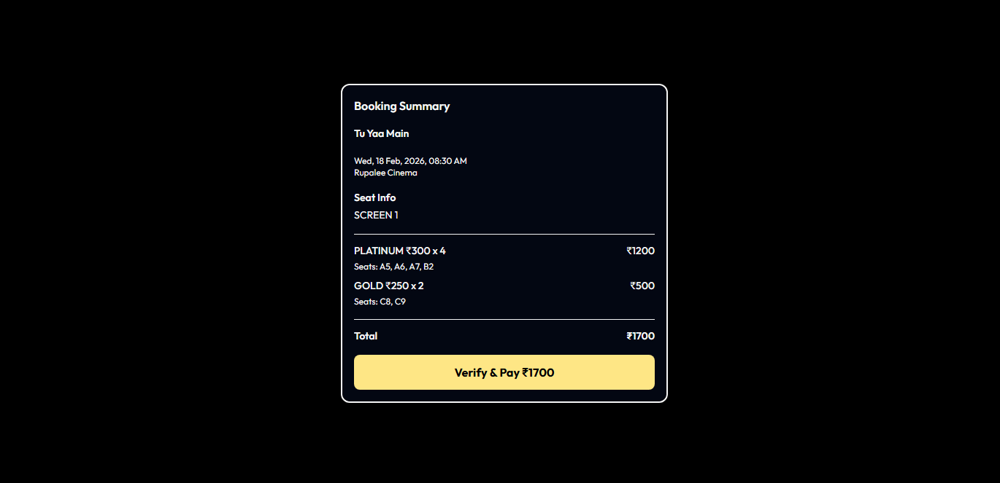
</p>

---

### ❤️ Favorite Page
<p align="center">
  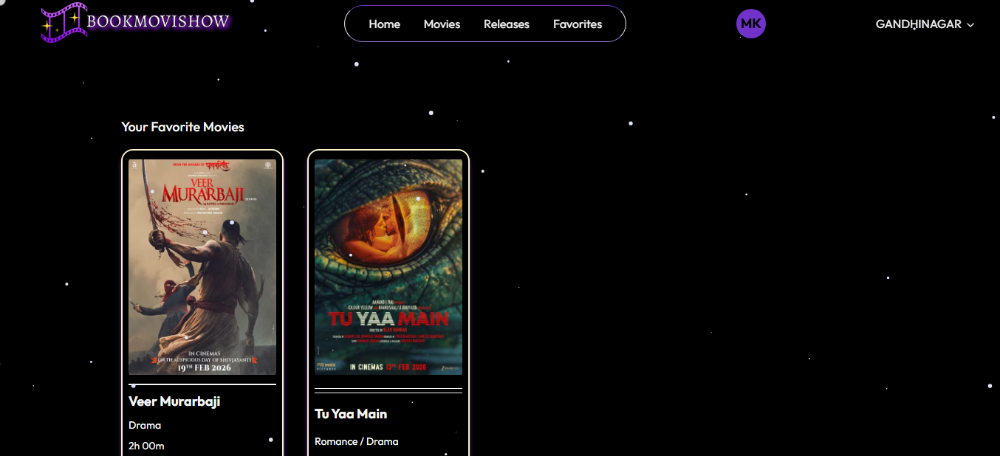
</p>

---

## 🛠️ Tech Stack

### Frontend
- React.js  
- Tailwind CSS  
- React Router  
- Axios  

### Backend
- Node.js  
- Express.js  
- MongoDB Atlas  
- Mongoose  

### APIs & Services
- PVR Cinema APIs  
- Geoapify API  
- Razorpay Payment Gateway  

### Authentication
- JWT (Access Token & Refresh Token)  

---

## ⚙️ Installation & Setup

### Clone the Repository

```bash
git clone https://github.com/mihir1707/BookMoviShow.git
```

### Install Dependencies

Frontend:
```bash
cd Frontend
npm install
```

Backend:
```bash
cd Backend
npm install
```

### Setup Environment Variables

Create a `.env` file inside the **Backend** folder:

```
PORT=8000
MONGODB_URL=your_mongodb_connection_string
CORS_ORIGIN=*

ACCESS_TOKEN_SECRET=your_access_token_secret
ACCESS_TOKEN_EXPIRY=1d

REFRESH_TOKEN_SECRET=your_refresh_token_secret
REFRESH_TOKEN_EXPIRY=10d

PVR_CITIES_API=https://api3.pvrcinemas.com/api/v1/booking/content/city
PVR_NOWSHOWING_API=https://api3.pvrcinemas.com/api/v1/booking/content/nowshowing
PVR_COMINGSOON_API=https://api3.pvrcinemas.com/api/v1/booking/content/comingsoon

GEOAPIFY_KEY=your_geoapify_api_key

RAZORPAY_KEY_ID=your_razorpay_key_id
RAZORPAY_KEY_SECRET=your_razorpay_key_secret
```

### Run the Application

Start Backend:
```bash
cd Backend
npm run dev
```

Start Frontend:
```bash
cd Frontend
npm run dev
```

---

## 🔐 Seat Locking Mechanism

- Selected seats are temporarily locked.  
- Other users cannot book the same seats during the lock period.  
- Successful payment confirms booking.  
- Failed or expired payments automatically release seats.  

This prevents race conditions and double booking issues.

---

## 🔮 Future Improvements

- Admin Dashboard  
- Email Ticket Confirmation  
- QR Code Based Ticket System  
- Real-Time WebSocket Seat Updates  
- Movie Reviews & Ratings  
- Cloud Deployment (Render / Railway / Vercel)  

---

## 👨‍💻 Author

Mihir Khunt  
GitHub: https://github.com/mihir1707  

---

## 📄 License

This project is built for educational and learning purposes.
